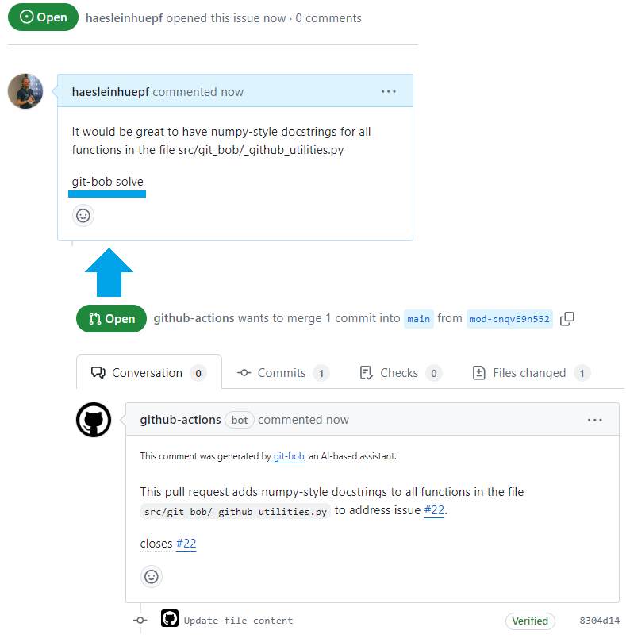
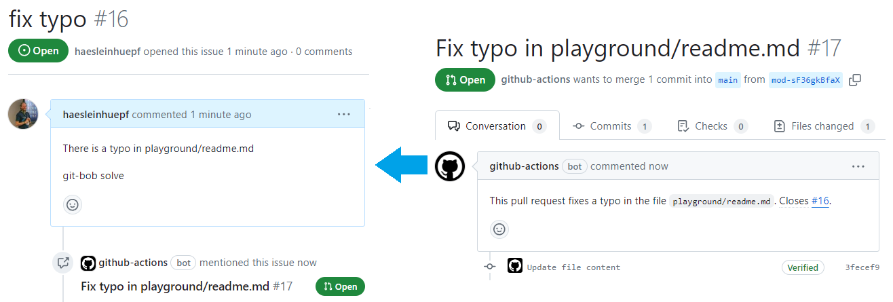
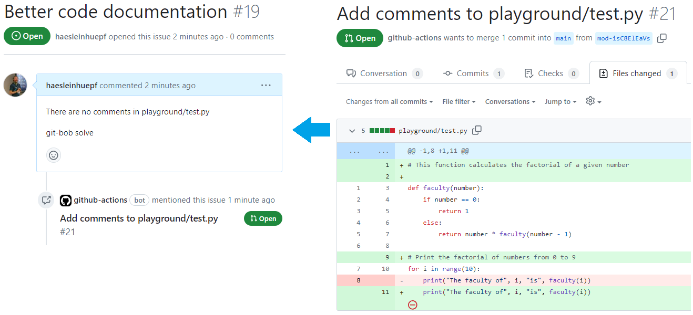
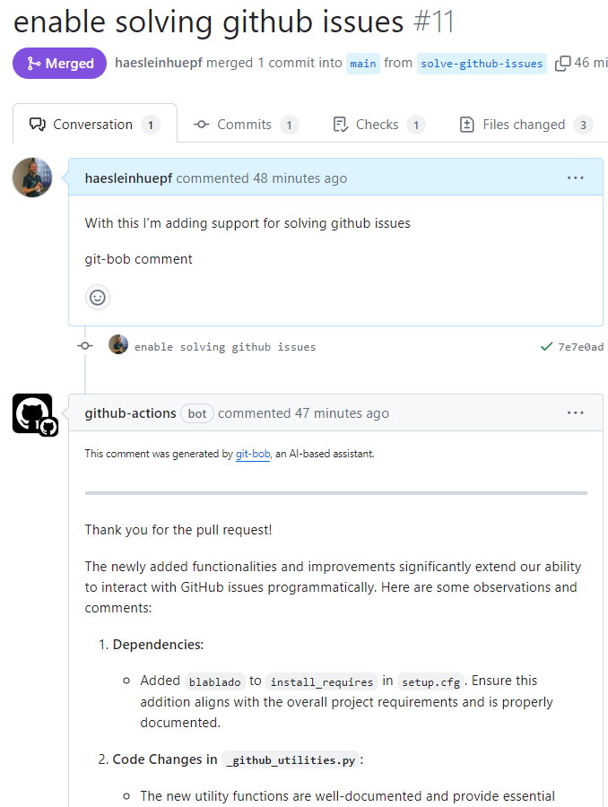
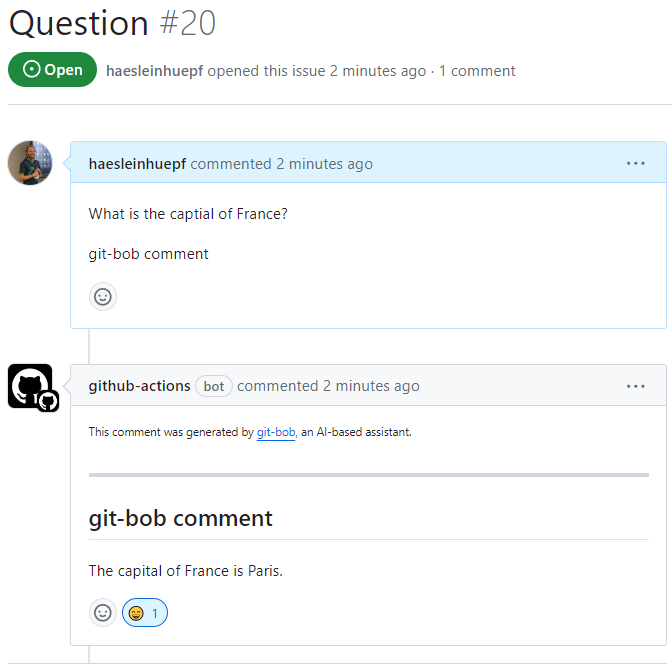

# git-bob

git-bob uses AI to solve Github-issues and review pull-requests. It runs inside the Github CI, no need to install anything on your computer.



Under the hood it uses [gpt-4 omni](https://chat.openai.com/) to understand the text and 
[pygithub](https://github.com/PyGithub/PyGithub) to interact with the issues and pull-requests.

## Disclaimer

`git-bob` is a research project aiming at streamlining Github interaction in software development projects. Under the hood it uses
artificial intelligence / large language models to generate text and code fulfilling the user's requests. 
Users are responsible to verify the generated code according to good scientific practice.

When using `git-bob` you configure it to use an API key to access the AI models. 
You have to pay for the usage and must be careful in using the software.
Do not use this technology if you are not aware of the costs and consequences.

> [!CAUTION]
> When using the OpenAI, Google Gemini, Anthropic or any other endpoint via git-bob, you are bound to the terms of service 
> of the respective companies or organizations.
> The prompts you enter are transferred to their servers and may be processed and stored there. 
> Make sure to not submit any sensitive, confidential or personal data. Also using these services may cost money.

## Installation as Github action

There is a detailed [tutorial](docs/installation-tutorial.md) on how to install git-bob as github action to your repository. In very short, to use git-bob in your Github repository, you need to 
* setup Github workflows like shown in [this folder](.github/workflows).
  * Make sure to replace `pip install -e .` with a specific git-bob version such as `pip install git-bob==0.1.0`.
  * Configure the LLM you want to use in the workflow files by specifying the `GIT_BOB_LLM_NAME` environment variable.
* configure a Github secret called `OPENAI_API_KEY` depending on the above configured LLM.
* configure Github actions to run the workflow on issues and pull-requests. Also give write-access to the action runner.

To trigger git-bob, you need to comment on an issue or pull-request with the following command:

```
git-bob comment
```

When using openai/gpt-4-omni, you can also use the following command to trigger git-bob.
It will then try to solve the issue and send a pull-request.

```
git-bob solve
```

### Use-case examples

* `git-bob` can fix typos ([issue](https://github.com/haesleinhuepf/git-bob/issues/16), [pull-request](https://github.com/haesleinhuepf/git-bob/pull/17)):



* `git-bob` can improve code documentation ([issue](https://github.com/haesleinhuepf/git-bob/issues/19), [pull-request](https://github.com/haesleinhuepf/git-bob/pull/21)):



* `git-bob` can review pull-requests and provide feedback ([pull-request](https://github.com/haesleinhuepf/git-bob/pull/11)):



* `git-bob` can also be exploited to answer questions ([issue](https://github.com/haesleinhuepf/git-bob/issues/20)).




## Installation as command-line tool

You can also install git-bob locally and run it from the terminal. 
In this case, create a [Github token](https://github.com/settings/tokens) and store it in an environment variable named `GITHUB_API_KEY`. 
Also create an environment variable `GIT_BOB_LLM_NAME` with the name of the LLM you want to use, e.g. "gpt-4o-2024-05-13" or "claude-3-5-sonnet-20240620".
Then you can install git-bob using pip:

```bash
pip install git-bob
```

## Usage as command-line tool

You can then use git-bob from the terminal on repositories you have read/write access to.

```bash
git_bob <action> <organization>/<repository> <issue-number>
```

Available actions:
* `review-pull-request`
* `comment-on-issue`
* `solve-issue` (only works with OpenAI/gpt-4-omni at the moment)

## Limitations
`git-bob` is a research project and has limitations. It serves as basis for discussion and further development. Once LLMs become better, `git-bob` will become better as well.

At the moment, these limitations can be observed:
* `git-bob` was tested for Python projects only (yet).
* It sometimes halucinates, especially in code reviews. E.g. it [claimed](https://github.com/haesleinhuepf/git-bob/pull/70) to have tested code, which is certainly not true.
* It cannot solve issues where changing long files is required, as the output of the LLMs is limited to 4096 tokens.
* It cannot solve issues where running and testing the code is required. 
* When changing multiple files, it may introduce conflicts between the files, as it does not know about the content of the other files.
* It has only limited logic to control who is allowed to trigger it. 
  If you are a repository member, you can trigger it. 
  If others send a pull-request, a repository member must allow the action to run manually.
* `git-bob` is incompatible with locally running open-source/-weight LLMs. 
  This might make sense when being executed locally only. In the Github-CI this might be impossible.

## Similar projects

There are similar projects out there
* [Claude Engineer](https://github.com/Doriandarko/claude-engineer)
* [BioChatter](https://github.com/biocypher/biochatter)
* [aider](https://github.com/paul-gauthier/aider)
* [OpenDevin](https://github.com/OpenDevin/OpenDevin)
* [Devika](https://github.com/stitionai/devika)
* [GPT-Codemaster](https://github.com/dex3r/GPT-Codemaster)

## Contributing

Feedback and contributions are welcome! Just open an issue and let's discuss before you send a pull-request. 
A [human](https://haesleinhuepf.github.io) will respond and comment on your ideas!


## Acknowledgements

We acknowledge the financial support by the Federal Ministry of Education and Research of Germany and by Sächsische Staatsministerium für Wissenschaft, Kultur und Tourismus in the programme Center of Excellence for AI-research „Center for Scalable Data Analytics and Artificial Intelligence Dresden/Leipzig“, project identification number: ScaDS.AI
